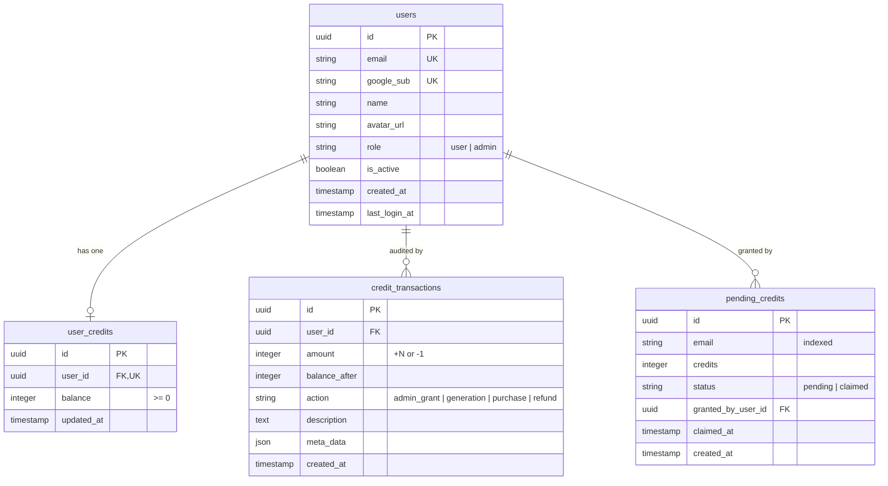

# Architecture & Design: Google Authentication & Credit System

This document outlines the architecture, database schema, security flows, and pricing economics for the **Google Authentication & Admin Credit System** in instaXoom.

---

## 1. System Architecture

```mermaid
flowchart TD
    subgraph Client["Next.js 15 Client (App Router)"]
        UI["Studio & Admin UI"]
        AuthCtx["AuthContext & @react-oauth/google"]
    end

    subgraph GoogleAuth["Google Cloud Platform"]
        GIdentity["Google Identity Services (OAuth 2.0)"]
    end

    subgraph Backend["FastAPI Backend Gateway"]
        AuthRouter["/api/auth (Login & Profile)"]
        AdminRouter["/api/admin (Credits & Audit)"]
        TrendsRouter["/api/trends (Generation & Deduction)"]
        Sec["Security & JWT Engine"]
    end

    subgraph DB["Neon Serverless PostgreSQL"]
        TUsers["users"]
        TCredits["user_credits"]
        TPending["pending_credits"]
        TTx["credit_transactions"]
    end

    subgraph Engines["AI Inference Engines"]
        AzureEngine["Azure AI Foundry (gpt-image-2.5-flare)"]
        FluxEngine["ComfyUI Headless (FLUX.1 Schnell + PuLID)"]
    end

    UI -->|1. Sign in with Google| GIdentity
    GIdentity -->|2. Google ID Token| AuthCtx
    AuthCtx -->|3. POST /api/auth/google| AuthRouter
    AuthRouter -->|4. Verify Token & Upsert| Sec
    Sec -->|5. Read/Write| DB
    AuthRouter -->|6. Return JWT + User Profile| AuthCtx
    
    UI -->|7. POST /api/trends/generate (Bearer JWT)| TrendsRouter
    TrendsRouter -->|8. Verify >= 1 Credit| TCredits
    TrendsRouter -->|9. Dispatch Job| Engines
    Engines -->|10. Return Output Image| TrendsRouter
    TrendsRouter -->|11. Deduct 1 Credit & Log Audit| DB
```

---

## 2. Authentication & Authorization Flow

### 2.1 Google Sign-In & Role Assignment
1. **Frontend Authentication:** The user clicks the Google Sign-in button rendered via `@react-oauth/google`. Google popups or prompts the user, issuing a cryptographically signed Google ID Token (JWT).
2. **Backend Verification:** Frontend transmits the token to `POST /api/auth/google`. The backend validates the signature against Google's public JWKS keys using `google-auth`.
3. **Role Determination:**
   - The user's email is compared against the `ADMIN_EMAILS` environment variable (comma-separated list).
   - If present, the user is assigned `role="admin"`.
   - Otherwise, the user is assigned `role="user"`.
4. **App JWT Session:** The backend signs an internal JWT access token containing `{ sub: user_id, email, role }`, valid for 7 days (`JWT_EXPIRE_MINUTES=10080`).

### 2.2 Admin Auto-Redirect
- When an admin signs in via Google on the home page, the frontend detects `user.role === 'admin'` and automatically navigates them to the `/admin` portal.
- Regular users remain on the studio page (`/`).
- The `/admin` route is guarded by an authorization check: if a non-admin attempts to access `/admin`, they are redirected to `/`.

---

## 3. Database Schema (Neon Serverless PostgreSQL)

The database schema is implemented with SQLAlchemy 2.0 (asyncpg) with automatic table creation (`init_db()`) on backend startup.



### 3.1 Tables Overview
- **`users`**: Stores profile information synced from Google OAuth.
- **`user_credits`**: Maintains the live credit balance for each user. New accounts default to `0` credits.
- **`pending_credits`**: Enables admins to assign trial credits to any email **before** that user registers. When the user later logs in with Google for the first time, pending grants matching their email are automatically claimed and added to their credit balance.
- **`credit_transactions`**: Immutable audit ledger recording every credit delta, the resulting balance, action type, description, and metadata (e.g. `job_id`, `theme_id`).

---

## 4. Credit System & Enforcement Rules

| Rule | Specification |
| :--- | :--- |
| **Credit Conversion** | **1 Credit = 1 Portrait Generation** |
| **Initial Free Credits** | **0 Credits** for unassigned signups |
| **Trial Provisioning** | Admins assign credits to user emails via `/admin` |
| **Balance Check** | Before generation starts, backend verifies `balance >= 1` |
| **Insufficient Credits** | Backend returns `HTTP 402 Payment Required`; UI shows warning |
| **Deduction Timing** | Deducted **only upon successful generation** (both Azure and Local FLUX) |
| **Concurrency Safe** | Dedicated database session isolates credit deduction from long inference streams |

---

## 5. Pricing Economics & Competitor Benchmarking

### 5.1 Unit Economics
- **User Price:** 1 credit = **$0.50** (equivalent to $0.50 per image generation).
- **Azure AI Foundry GPU Inference Cost:** ~$0.04 per image (using `gpt-image-2.5-flare`).
- **Neon PostgreSQL & Hosting Cost:** Serverless compute with scale-to-zero ($0/month base cost).
- **Gross Margin:** **~92% gross margin** per generated portrait.

### 5.2 Market Competitor Comparison

| Platform | Pricing Model | Effective Cost per Image | Notes |
| :--- | :--- | :--- | :--- |
| **instaXoom** | **1 credit = $0.50** | **$0.50** | Single image per trend, no bulky bundles required |
| **HeadshotPro** | $29 for 40 photos | ~$0.72 | Minimum $29 upfront commitment |
| **Aragon AI** | $35 for 20 photos | ~$1.75 | Expensive entry tier |
| **PhotoAI** | $29/mo for 100 photos | ~$0.29 | Subscription lock-in required |
| **Lensa AI** | $7.99 for 50 avatars | ~$0.16 | Bulk avatar batch (older SD 1.5 quality) |

---

## 6. Admin Portal Capabilities (`/admin`)

The admin portal provides real-time oversight and license/credit distribution:

1. **Trial Credit Assignment:**
   - Input any recipient email.
   - Quick-select credit amounts (+5, +10, +25) or custom integer.
   - Optional audit note.
   - Instant activation for registered users or reservation for new signups.
2. **KPI Analytics:**
   - Total Registered Users (Google accounts).
   - Circulating Credits (total balance across active users).
   - Pending Grants (credits awaiting user signup).
   - Total Audit Records.
3. **Tabbed Data Views:**
   - **Users:** Search by email or name, view role, balance, registration date, and last login. Includes quick "+ Add Credits" action.
   - **Pending Grants:** Tracks invitations and reserved balances.
   - **Audit Log:** Full chronological ledger of grants and generation deductions.
